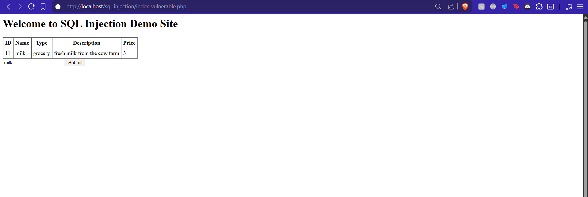
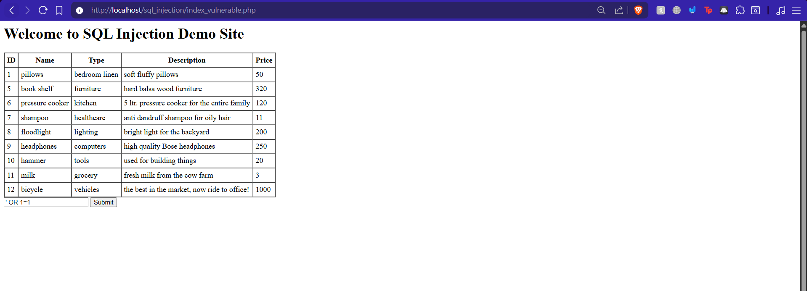
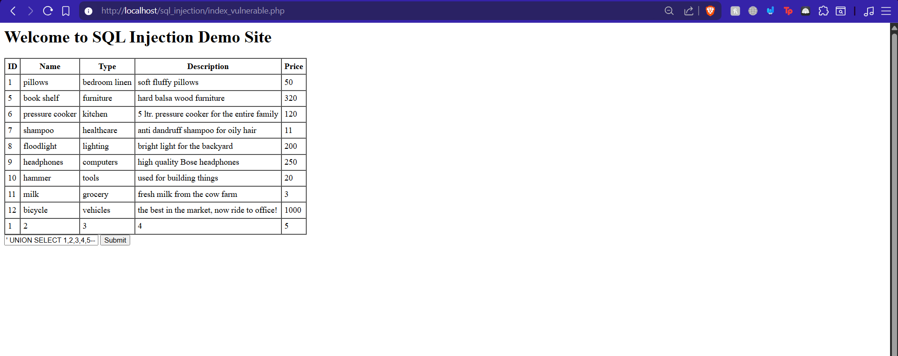
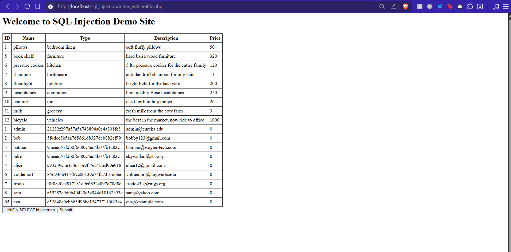
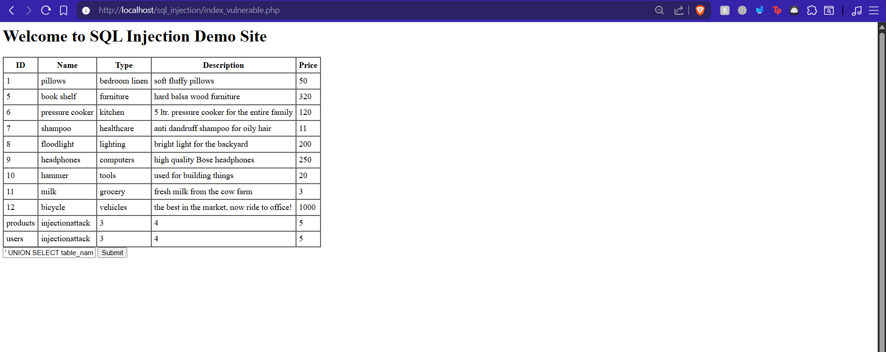
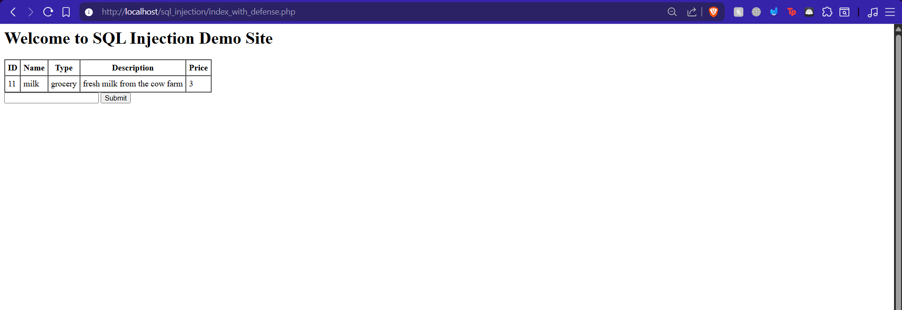
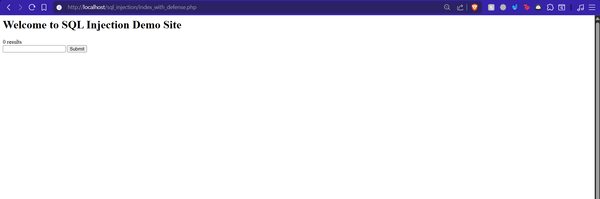

# SQL Injection Lab — "A Leaky Database"

Eureka Labs

## What is this?

A hands-on lab demonstrating how SQL injection works against a vulnerable PHP/MySQL web application, and how simple input sanitization can stop it. The application is a product search page backed by a MySQL database with two tables: `products` (store inventory) and `users` (login credentials).

## How it works

The web app takes user input from a text field and plugs it directly into an SQL query using the `LIKE` operator:

```sql
SELECT id, product_name, product_type, description, price
FROM products WHERE product_name LIKE '%USER_INPUT%'
```

Because the input is not sanitized, an attacker can break out of the query string and inject their own SQL to extract data from any table in the database.

## The Attack — Step by Step

### 1. Normal search

Searching for `milk` returns the expected single result from the products table.



### 2. Testing for injection

Entering `' OR 1=1-- ` (a single quote to close the string, `OR 1=1` to make the WHERE clause always true, and `--` to comment out the rest) dumps **every row** in the products table. This confirms the app is vulnerable.



### 3. Finding the column count with UNION

Entering `' UNION SELECT 1,2,3,4,5-- ` appends a second SELECT to the original query. The injected row (`1, 2, 3, 4, 5`) appears at the bottom of the results, confirming the products table has 5 columns. This is necessary because a UNION requires both SELECTs to have the same number of columns.



### 4. Extracting user credentials (the main attack)

Now that we know the column count, we can pull data from any table. Entering `' UNION SELECT id, username, psswd, email, 0 FROM users-- ` dumps every user's ID, username, password hash (MD5), and email address. This is the full compromise — an attacker now has credentials for admin, bob, batman, alice, and others.



### 5. Database reconnaissance

Entering `' UNION SELECT table_name, table_schema, 3, 4, 5 FROM information_schema.tables WHERE table_schema = database()-- ` queries MySQL's metadata to discover all tables in the current database. The result reveals two tables: `products` and `users`, along with the database name `injectionattack`.



## The Defense

The fix is input sanitization — stripping dangerous characters before the input reaches the SQL query:

```php
$product = rtrim($product);
$product = str_replace(array("(", ")", ";", "--"), '', $product);
```

`rtrim()` removes trailing whitespace, and `str_replace()` strips parentheses, semicolons, and comment markers that are essential for injection payloads.

### Defense verified — normal search still works

After enabling the sanitization, a legitimate search for `milk` returns the correct result.



### Defense verified — attack is blocked

The same UNION injection that previously dumped all user data now returns **0 results**. The dangerous characters were stripped, breaking the injected SQL.



## Project structure

```
sql_injection/
├── docker-compose.yml            # Docker services (Apache, PHP, MySQL)
├── apache/
│   ├── Dockerfile
│   └── project.apache.conf
├── php/
│   └── Dockerfile
├── mysql/
│   └── db-init.sql               # Database schema and sample data
└── public_html/
    └── index.php                 # Web app with defense implemented
```

## Running the lab

```bash
cd sql_injection
docker-compose up
```

Open **http://127.0.0.1:8080/** to access the application.

## References

- Eureka Labs — "A Leaky Database" by Liran Ma and Zhipeng Cai, Texas Christian University
- [OWASP SQL Injection](https://owasp.org/www-community/attacks/SQL_Injection)
- [MySQL UNION-based injection](https://dev.mysql.com/doc/refman/8.0/en/union.html)
